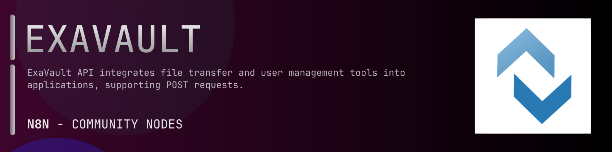

# @n8n-dev/n8n-nodes-exavault



[](https://www.npmjs.com/package/@n8n-dev/n8n-nodes-exavault)
[](https://opensource.org/licenses/MIT)

---

**Stop writing exavault API integrations by hand.**

Every time you connect n8n to exavault, you waste hours mapping endpoints, defining parameters, and debugging schemas. You copy-paste from docs, fix edge cases, and pray nothing breaks.

**What if connecting n8n to exavault took 5 minutes, not half a day?**

This node gives you **13+ resources** out of the box: **Authentication**, **Resources**, **Activity**, **Users**, **Shares**, and 8 more: with full CRUD operations, typed parameters, and zero manual configuration.

---

## What You Get

- **Zero boilerplate**: Resources, operations, and fields are pre-configured and ready to use
- **Full CRUD**: Create, read, update, and delete support where the API allows it
- **Typed parameters**: No more guessing field types
- **Built-in auth**: API key authentication, ready to go
- **Declarative**: Native n8n performance, no custom execute() overhead

---

## Install

```bash
npm install @n8n-dev/n8n-nodes-exavault
```

**Or in n8n:**
1. **Settings → Community Nodes → Install**
2. Search: `@n8n-dev/n8n-nodes-exavault`
3. Click **Install**

---

## Quick Start

1. Install the node (above)
2. Add credentials: **exavault API** → paste your API key
3. Drag the **exavault** node into your workflow
4. Pick a resource → pick an operation → done.

That's it. No configuration files. No code. It just works.

---

## Resources

<details>
<summary><b>Resources</b> (15 operations)</summary>

- Delete Resources
- Get Resource Properties
- Post Create a folder
- Post Compress resources
- Post Copy resources
- Get Download a file
- Post Extract resources
- Get a list of all resources
- Get List contents of folder
- Post Move resources
- Get Preview a file
- Post Upload a file
- Delete a Resource
- Get resource metadata
- Patch Rename a resource

</details>

<details>
<summary><b>Activity</b> (2 operations)</summary>

- Get activity logs
- Get WEBHOOK logs

</details>

<details>
<summary><b>Users</b> (5 operations)</summary>

- Get a list of users
- Post Create a user
- Delete a user
- Get info for a user
- Patch Update a user

</details>

<details>
<summary><b>Shares</b> (6 operations)</summary>

- Get a list of shares
- Post Creates a share
- Post Complete send files
- Delete Deactivate a share
- Get a share
- Patch Update a share

</details>

<details>
<summary><b>Notifications</b> (5 operations)</summary>

- Get a list of notifications
- Post Create a new notification
- Delete a notification
- Get notification details
- Patch Update a notification

</details>

<details>
<summary><b>Email Lists</b> (5 operations)</summary>

- Get all email groups
- Post Create new email list
- Delete an email group with given ID
- Get individual email group
- Patch Update an email group

</details>

<details>
<summary><b>Account</b> (2 operations)</summary>

- Get account settings
- Patch Update account settings

</details>

<details>
<summary><b>SSH Keys</b> (4 operations)</summary>

- Get metadata for a list of SSH Keys
- Post Create a new SSH Key
- Delete an SSH Key
- Get metadata for an SSH Key

</details>

<details>
<summary><b>Form</b> (5 operations)</summary>

- Get receive folder form settings
- Delete a receive form submission
- Get form data entries for a receive
- Get receive folder form by ID
- Patch Updates a form with given parameters

</details>

<details>
<summary><b>Recipients</b> (1 operations)</summary>

- Post Resend invitations to share recipients

</details>

<details>
<summary><b>Email</b> (2 operations)</summary>

- Post Send referral email to a given address
- Post Resend welcome email to specific user

</details>

<details>
<summary><b>Webhooks</b> (7 operations)</summary>

- Get Webhooks List
- Post Add A New WEBHOOK
- Post Regenerate security token
- Post Resend a WEBHOOK message
- Delete a WEBHOOK
- Get info for a WEBHOOK
- Patch Update a WEBHOOK

</details>

---

## Why This Node?

**Without this node:**
- Hours of manual API integration
- Copy-pasting from exavault docs
- Debugging auth, pagination, error handling
- Maintaining your own client code

**With this node:**
- Install → configure → use. 5 minutes.
- Auto-generated from the official exavault OpenAPI spec
- Always up to date when the API changes
- Native n8n performance

---

## Auto-Generated
This node was auto-generated from the official **exavault** OpenAPI specification using
[@n8n-dev/n8n-openapi-node-ultimate](https://github.com/kelvinzer0/n8n-openapi-node-ultimate),
then validated against the live API so you get accurate types and real parameters, not guesswork.

When the exavault API updates, this node updates too.

---


## License

MIT © [kelvinzer0](https://github.com/n8n-code)
